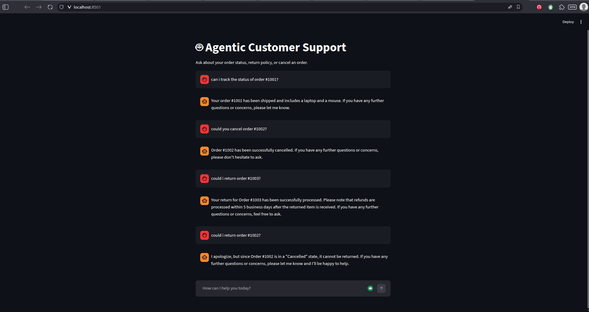
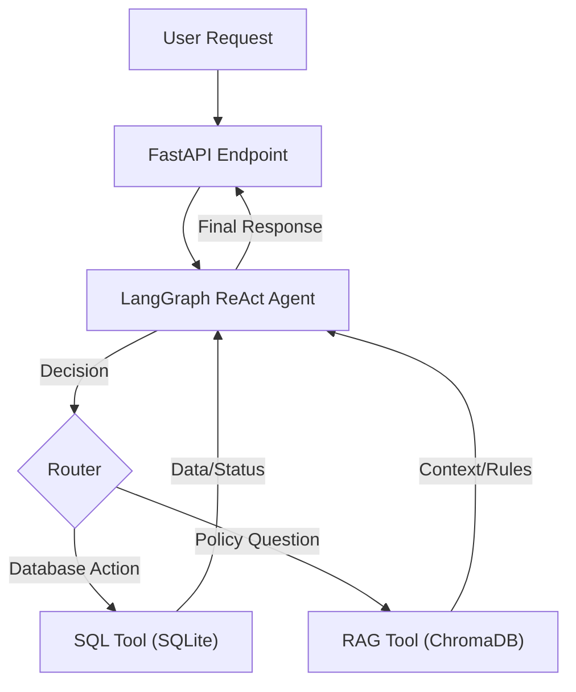

# 🤖 Agentic Customer Support AI (RAG + SQL + Docker)


-orange)


An intelligent, autonomous customer support agent capable of performing database actions (SQL) and answering policy questions (RAG). Built with **LangGraph**, powered by **Llama 3 via Groq**, and deployed as a **Dockerized Microservice**.

## 🚀 Project Overview

This is not a simple chatbot. It is a **ReAct Agent** (Reason + Act) that can autonomously decide *when* to query a database and *when* to read a knowledge base.

**Key Capabilities:**
* **Active Database Management:** Can query status, cancel orders, and process returns in a SQLite database.
* **Retrieval Augmented Generation (RAG):** Consults a vector database (ChromaDB) to answer policy questions (e.g., "return window") accurately without hallucinations.
* **Reflection Layer:** Implements a self-correction loop where the agent catches its own errors (e.g., invalid Order ID) and retries or asks for clarification.
* **Evaluation Suite:** Includes a CI/CD-ready test suite using **DeepEval** to measure Faithfulness and Answer Relevancy.



## 🏗️ Architecture

The system follows a microservice architecture wrapped in Docker.



### Technical Stack

* **LLM Engine:** Llama 3.3 (70B) via Groq API (Low latency inference).
* **Orchestration:** LangGraph (ReAct pattern).
* **Database:** SQLite (Transactional data) + ChromaDB (Vector store).
* **API Framework:** FastAPI.
* **Containerization:** Docker (Multi-stage build, optimized for size).
* **Testing:** DeepEval (Unit testing for AI responses).

## 🛠️ Installation & Setup

### Prerequisites

* Docker installed
* Groq API Key (Get one at [console.groq.com](https://console.groq.com))

### 1. Clone the Repository

```bash
git clone [https://github.com/yourusername/agentic-support-ai.git](https://github.com/yourusername/agentic-support-ai.git)
cd agentic-support-ai

```

### 2. Configure Environment

Create a `.env` file in the root directory:

```bash
GROQ_API_KEY=gsk_your_actual_key_here

```

### 3. Build & Run with Docker

We use a multi-stage Docker build to keep the image lightweight.

```bash
# Build the image
docker build -t agent-ai:v1 .

# Run the container (Mapping port 8000 -> 8080)
docker run -p 8000:8080 --env-file .env agent-ai:v1

```

## 🔌 API Usage

Once the container is running, the API is accessible at `http://localhost:8000`.

### **Endpoint:** `POST /chat`

**Example Request:**

```json
{
  "query": "I want to return order 1001.",
  "user_id": 1
}

```

**Example Response:**

```json
{
  "response": "I have successfully processed the return for Order #1001. A refund will be issued within 5 business days."
}

```

### Swagger UI

Visit `http://localhost:8000/docs` to test the endpoints interactively via the browser.

## 🧪 Evaluation & Testing

This project uses **DeepEval** to ensure reliability. The test suite evaluates:

1. **Faithfulness:** Does the answer contradict the `policies.txt`?
2. **Answer Relevancy:** Did the agent actually answer the user's prompt?

**To run the evaluation suite locally:**

```bash
# Install dev dependencies
pip install pytest deepeval

# Run tests
pytest tests/test_agent.py

```

**Sample Output:**

```text
✅ test_return_policy_accuracy PASSED
   - Faithfulness Score: 1.0
   - Relevancy Score: 1.0

```

## 📂 Project Structure

```text
├── app/
│   ├── agent.py           # Main LangGraph ReAct Logic & Reflection
│   ├── main.py            # FastAPI Entry Point
│   ├── tools/
│   │   ├── sql_tool.py    # Database interactions (Cancel/Return)
│   │   └── rag_tool.py    # Vector Search (ChromaDB)
│   └── data/
│       ├── orders.db      # SQLite Database
│       └── policies.txt   # RAG Knowledge Base
├── tests/
│   └── test_agent.py      # DeepEval Test Suite
├── Dockerfile             # Multi-stage container definition
├── requirements.txt       # Python dependencies
└── README.md              # Documentation

```

## 🛡️ Security Features

* **.dockerignore:** Prevents leaking `.env` and virtual environments into the image.
* **SQL Injection Protection:** Uses parameterized queries (`?` placeholders) for all database operations.
* **Environment Variables:** Secrets are managed via runtime injection, never hardcoded.

## 📜 License

MIT License
